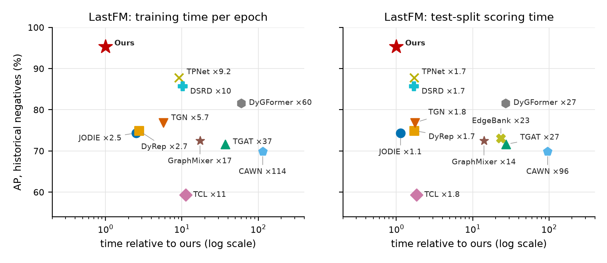

<div align="center">

<h1>Your Temporal Link Predictor Is Blind to Who Is Active</h1>
<h3>A Missing Factor That Transfers Across Models</h3>

<p>
<a href="https://arxiv.org/abs/2610.04869"></a>
<a href="https://arxiv.org/pdf/2610.04869"></a>
<a href="LICENSE"></a>


</p>

<p>
<b>Ji Zhang</b><sup>1*</sup>, <b>Zixin Liu</b><sup>2*</sup>, <b>Yiran Ding</b><sup>3*</sup>,
<b>Jiayi Wang</b><sup>1</sup>, <b>Yilu Du</b><sup>2</sup>, <b>Weijia Xuan</b><sup>4</sup>
</p>
<p>
<sup>1</sup>Harvard University &nbsp;&middot;&nbsp; <sup>2</sup>Wuhan University &nbsp;&middot;&nbsp;
<sup>3</sup>University of California, Berkeley &nbsp;&middot;&nbsp; <sup>4</sup>Tsinghua University
</p>
<p><sup>*</sup>Equal contribution</p>

</div>

---

## Overview

An interaction has two parts: someone decides to act, and then chooses whom to act on.
Temporal link prediction has concentrated on the second, and this paper shows that it is
**blind to the first by construction**. A standard training negative keeps the real source and
swaps the destination; we prove that this cancels the source's activity exactly from the
optimal score, so no model trained and evaluated this way is ever rewarded for learning it.
Under the harder historical and inductive negatives, whose sources differ, the same factor
becomes the dominant signal.

We close the blind spot with **Source Node Activity Modeling (SNAM)**: a self-exciting event
intensity fitted by an exact point-process likelihood to the decayed interaction counts that
the history states already contain. It has **fewer than 20 parameters** and transfers across
models without retraining.

This repository is the complete reproduction package of the paper: our model, the baseline
code we had to correct, the result file of every run, and the scripts that regenerate every
table and figure of the paper from those files.

## Highlights

- **A proof, not a heuristic.** Random-destination negatives hold the source and timestamp
  fixed, so source activity drops out of the optimal link score. The cancellation argument
  applies to any factor a negative sampler keeps fixed.
- **Fewer than 20 parameters beat full models.** Scoring with the SNAM intensity alone, never
  looking at the destination, outperforms DyGFormer and TPNet on four of five datasets under
  historical negatives.
- **Plug-in gains without retraining.** Added to the frozen scores of TPNet, TGN, DyGFormer and
  DSRD, four models of different design, SNAM raises AP on almost every backbone-dataset pair
  in both the transductive and inductive settings, by up to 25 points.
- **State of the art at a fraction of the cost.** The full model ranks first overall against
  eleven baselines on 13 datasets and three negative-sampling protocols, and on million-event
  streams trains an epoch 9-100x faster than TPNet and DyGFormer.
- **Reproducible to the byte.** Every number in the paper is regenerated from the shipped
  result files by one script; every correction to a released baseline is marked in its source.

<div align="center">

<p><i>LastFM: AP under historical negatives against per-epoch training time (left) and full
test-set scoring time (right), log scale. Our model attains the highest AP with the lowest
training and scoring times; TPNet and DyGFormer need about 9x and 60x our training time.</i></p>
</div>

## Repository layout

| folder | content |
|---|---|
| `model/` | our model: the state and its reads, training and evaluation scripts, per-stream configs (`model/README.md`) |
| `baselines/` | DyGLib, TPNet, GRN and DSRD as released, plus the corrections described in `baselines/README.md` |
| `results/` | the result files the paper's numbers come from: evaluation files of our runs, retrained baselines, transfer runs, ablations, timing records |
| `experiments/` | one folder per experiment: scripts that rebuild its tables or figures from `results/`, scripts that rerun it from the data, and a README |
| `outputs/` | the tables (`.tex`, `.md`) and figures (`.pdf`, `.png`) as regenerated by `make_all.py` |
| `data/` | download script and notes on the data |

No checkpoints and no data are included; `data/README.md` explains how to obtain the thirteen
streams from their public source.

## Reproducing the paper

### From the shipped result files (minutes, no GPU)

```bash
pip install numpy matplotlib
python make_all.py
```

This regenerates every table and figure into `outputs/`. Every number in the paper's tables
and every figure comes from these outputs; for a few main-text tables the paper's copy differs
only in layout (a shorter caption, a wider table environment, two tables set side by side).

### From the data (GPU)

```bash
bash data/get_data.sh <data_root>          # the thirteen streams, from the public Zenodo record
python experiments/01_main_comparison/run_main.py --data_root <data_root> --out_dir <out>
```

Each `experiments/<name>/` folder has one or more `run_*.py` scripts that train and evaluate and
write result files in the same layout as `results/`. The README of each folder gives the
commands, what they cost and how to check the outcome. To rebuild the paper's tables from your
own runs, copy `results/` to a folder of your own, replace the files you regenerated, and run

```bash
REPRO_RESULTS=<your folder> python make_all.py
```

### Training a single run

```bash
cd model
python scripts/train_sfs.py --config configs/uci.json --data_root <data_root> --out_dir <out> --run 0 --tag _final \
    --epochs 500 --patience 100 --print_every 5
python scripts/evaluate_sfs.py --ckpt <out>/uci_final_run0.pt --config configs/uci.json --data_root <data_root> \
    --settings transductive,inductive --periods val,test --out <out>/uci_final_run0_eval.json
```

`model/README.md` documents every flag and maps the names used in the code to the names used
in the paper.

### Environment

Python 3.12, PyTorch 2.8 with CUDA, numpy, pandas, scikit-learn, tqdm; matplotlib for the
figures. The baseline trees have their own requirements files (`TPNet_strict/requirements.txt`;
`GRN_honest/requirements.txt` is DyGLib's environment and serves `DyGLib/` and `DSRD_honest/`
as well). Every run used a single NVIDIA GPU; the timing experiment used one RTX 5090 with
nothing else on the card.

## Experiments

| folder | what it measures | paper content |
|---|---|---|
| `01_main_comparison` | test AP and AUC of every model on thirteen streams under three negative-sampling protocols, transductive and inductive settings | the four main tables |
| `02_transfer` | our source-activity term added to the scores of four other models, without retraining them | the transfer tables |
| `03_time_scales` | our model retrained with a different number of timescales | the two tables on the number of timescales |
| `04_event_clock` | our model retrained with a different number of training blocks, with and without within-block updates | the table on blocks and within-block updates |
| `05_activity_term` | the source-activity term replaced by simpler functions of the same counts; the term alone against the base score alone | the two tables on the form of the term and the decomposition table |
| `06_speed` | training and scoring time of twelve models; the cost of our model against its own settings and against the stream length | the speed figures, the cost figure, the stream-length table |
| `07_beta_curves` | test AP as a function of the coefficient of the source-activity term | the two coefficient figures |
| `08_trunk_channels` | our model retrained with inputs of the relation branch removed: the recent interaction encoding, the random projections, the pair and endpoint counts, or all three | the table on the inputs of the relation branch |

Result folders and output files carry short labels (A1, A2, A3, A4, I1, S1, S2, S3); the README
of each experiment says which labels belong to it. The code and its READMEs use the code's own
names for the parts of the model; `model/README.md` maps them to the names used in the paper.

## Evaluation protocol

Every run follows the DyGLib protocol: chronological 70 / 15 / 15 split, 10 % of the nodes held
out for the inductive setting, the same seeds and the same three negative samplers (random,
historical, inductive) for every model; all models train with random negatives. Our model uses
DyGLib's own split, sampler and metric code (`model/tgmin/vendor/`, unmodified). AP and AUC-ROC
are computed per batch of 200 positives with their negatives and averaged, as in DyGLib.

Baseline numbers in the main tables come from the TPNet paper except where the released code had
to be corrected; those cells are retrained by us and marked with a dagger. `baselines/README.md`
describes each correction and `experiments/01_main_comparison/README.md` lists which cells are
affected.

## Citation

If you find this work useful, please cite:

```bibtex
@article{zhang2026blind,
  title   = {Your Temporal Link Predictor Is Blind to Who Is Active: A Missing Factor That Transfers Across Models},
  author  = {Zhang, Ji and Liu, Zixin and Ding, Yiran and Wang, Jiayi and Du, Yilu and Xuan, Weijia},
  journal = {arXiv preprint arXiv:2610.04869},
  year    = {2026},
  url     = {https://arxiv.org/abs/2610.04869}
}
```

## Acknowledgements

The evaluation protocol, data loaders and several baselines come from
[DyGLib](https://github.com/yule-BUAA/DyGLib) (Yu et al., NeurIPS 2023); the thirteen streams are
distributed through its public Zenodo record. We also build on the released code of
TPNet (Lu et al., NeurIPS 2024), Graph Retention Networks (Chang et al., WWW 2026) and DSRD
(Chang et al., 2026); our corrections to these code bases are documented in `baselines/README.md`.

## License

Our code is released under the MIT License (`LICENSE`). The baseline trees in `baselines/` keep
their upstream MIT licenses, which are included in each folder.

## Contact

Ji Zhang (jizhang@g.harvard.edu). Issues and pull requests are welcome.
